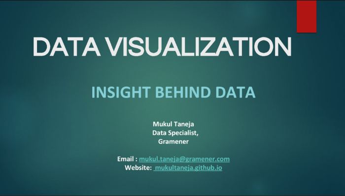
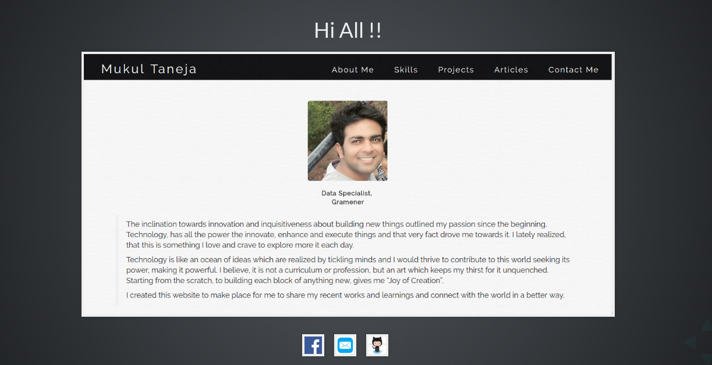

    

        

            

            

                

                    <nav class="navbar navbar-expand-lg">
                        

                            <ul class="navbar-nav w-100">
                                <li class="nav-item w-30 pr-5 text-center">
                                    <a href="/" class="home-link">
                                        Home
                                    </a>
                                </li>
                            </ul>
                        

                    </nav>
                

            

            

                

                    <nav class="navbar navbar-expand-lg">
                        

                            <ul class="navbar-nav w-100">
                                <li class="nav-item w-30 pr-5 pl-5 text-center">
                                    <a href="#skills" class="skills-link">
                                        Skills
                                    </a>
                                </li>
                                <li class="nav-item w-30 pr-5 pl-5 text-center">
                                    <a href="#rewards" class="rewards-link">
                                        Activities
                                    </a>
                                </li>
                                <li class="nav-item w-30 pr-5 pl-5 text-center">
                                    <a href="/blogs" class="blogs">
                                        Blogs
                                    </a>
                                </li>
                                <li class="nav-item w-30 pr-5 pl-5 text-center">
                                    <a href="resume/resume.pdf" class="resume" target="_blank">
                                        Resume
                                    </a>
                                </li>
                            </ul>
                        

                    </nav>
                

            

            

        

        

        

            

            

                

                    

                        <figure class="figure h-75 w-75 mt-5">
                            
                        </figure>
                    

                

            

            

                

                    

                        <blockquote class="pt-5 mt-5">
                            

                                The inclination towards innovation and inquisitiveness about building new things outlined my passion since the beginning. Technology, has all the power the innovate, enhance and execute things and that very fact drove me towards it. I lately realized, that this is something I love and crave to explore more it each day.
                            

                            

                                Technology is like an ocean of ideas which are realized by tickling minds and I would thrive to contribute to this world seeking its power, making it powerful. I believe, it is not a curriculum or profession, but an art which keeps my thirst for it unquenched. Starting from the scratch, to building each block of anything new, gives me “Joy of Creation”.
                            

                            

                                I created this website to make place for me to share my recent works and learnings and connect with the world in a better way.
                            

                            

                                To make things work is such an exciting thing, and that is what I always want to play with. Thinking like a programmer and realizing the power of science and technology in every step is what I enjoy to the core. This introduces a desire to learn something new, more and make things magnificent. Simple and clear thoughts lead to great ideas, and I believe I have a long way to go.
                            

                        </blockquote>
                    

                

            

        

        

            

            

                

                    <blockquote>
                        
@Mukul Taneja

                    </blockquote>
                

                

                    <blockquote>
                        

                            data enthusiast, data viz expert, full stack developer, passionate programmer, quick learner, loves to read books and listen to music
                        

                    </blockquote>
                

                

                    <ul class="list-group">
                        <li aria-label="Org: VMware">
                            <svg class="octicon octicon-location" viewBox="0 0 16 16" version="1.1" width="16" height="16" aria-hidden="true"><path fill-rule="evenodd" d="M1.5 14.25c0 .138.112.25.25.25H4v-1.25a.75.75 0 01.75-.75h2.5a.75.75 0 01.75.75v1.25h2.25a.25.25 0 00.25-.25V1.75a.25.25 0 00-.25-.25h-8.5a.25.25 0 00-.25.25v12.5zM1.75 16A1.75 1.75 0 010 14.25V1.75C0 .784.784 0 1.75 0h8.5C11.216 0 12 .784 12 1.75v12.5c0 .085-.006.168-.018.25h2.268a.25.25 0 00.25-.25V8.285a.25.25 0 00-.111-.208l-1.055-.703a.75.75 0 11.832-1.248l1.055.703c.487.325.779.871.779 1.456v5.965A1.75 1.75 0 0114.25 16h-3.5a.75.75 0 01-.197-.026c-.099.017-.2.026-.303.026h-3a.75.75 0 01-.75-.75V14h-1v1.25a.75.75 0 01-.75.75h-3zM3 3.75A.75.75 0 013.75 3h.5a.75.75 0 010 1.5h-.5A.75.75 0 013 3.75zM3.75 6a.75.75 0 000 1.5h.5a.75.75 0 000-1.5h-.5zM3 9.75A.75.75 0 013.75 9h.5a.75.75 0 010 1.5h-.5A.75.75 0 013 9.75zM7.75 9a.75.75 0 000 1.5h.5a.75.75 0 000-1.5h-.5zM7 6.75A.75.75 0 017.75 6h.5a.75.75 0 010 1.5h-.5A.75.75 0 017 6.75zM7.75 3a.75.75 0 000 1.5h.5a.75.75 0 000-1.5h-.5z"></path></svg>
                            Member of Technical Staff @VMware
                        </li>
                        <li aria-label="Location: Bangalore">
                            <svg class="octicon octicon-location" viewBox="0 0 16 16" version="1.1" width="16" height="16" aria-hidden="true"><path fill-rule="evenodd" d="M11.536 3.464a5 5 0 010 7.072L8 14.07l-3.536-3.535a5 5 0 117.072-7.072v.001zm1.06 8.132a6.5 6.5 0 10-9.192 0l3.535 3.536a1.5 1.5 0 002.122 0l3.535-3.536zM8 9a2 2 0 100-4 2 2 0 000 4z"></path></svg>
                            Bangalore, India
                        </li>
                        <li aria-label="Email: mukultaneja91@gmail.com">
                            <svg class="octicon octicon-mail" viewBox="0 0 16 16" version="1.1" width="16" height="16" aria-hidden="true"><path fill-rule="evenodd" d="M1.75 2A1.75 1.75 0 000 3.75v.736a.75.75 0 000 .027v7.737C0 13.216.784 14 1.75 14h12.5A1.75 1.75 0 0016 12.25v-8.5A1.75 1.75 0 0014.25 2H1.75zM14.5 4.07v-.32a.25.25 0 00-.25-.25H1.75a.25.25 0 00-.25.25v.32L8 7.88l6.5-3.81zm-13 1.74v6.441c0 .138.112.25.25.25h12.5a.25.25 0 00.25-.25V5.809L8.38 9.397a.75.75 0 01-.76 0L1.5 5.809z"></path></svg>
                            <a href="mailto:mukultaneja91@gmail.com">mukultaneja91@gmail.com</a>
                        </li>
                        <li aria-label="linkedin: https://www.linkedin.com/in/mukultaneja/">
                            <svg viewBox="0 0 24 24" version="1.1" width="16" height="16" aria-hidden="true"><path d="M19 0h-14c-2.761 0-5 2.239-5 5v14c0 2.761 2.239 5 5 5h14c2.762 0 5-2.239 5-5v-14c0-2.761-2.238-5-5-5zm-11 19h-3v-11h3v11zm-1.5-12.268c-.966 0-1.75-.79-1.75-1.764s.784-1.764 1.75-1.764 1.75.79 1.75 1.764-.783 1.764-1.75 1.764zm13.5 12.268h-3v-5.604c0-3.368-4-3.113-4 0v5.604h-3v-11h3v1.765c1.396-2.586 7-2.777 7 2.476v6.759z"/></svg>
                            <a href="https://www.linkedin.com/in/mukultaneja/" target="_blank">https://www.linkedin.com/in/mukultaneja/</a>
                        </li>
                        <li aria-label="facebook: https://www.facebook.com/techymac">
                            <svg class="octicon octicon-mail" viewBox="0 0 24 24" version="1.1" width="16" height="16" aria-hidden="true"><path d="M22.675 0h-21.35c-.732 0-1.325.593-1.325 1.325v21.351c0 .731.593 1.324 1.325 1.324h11.495v-9.294h-3.128v-3.622h3.128v-2.671c0-3.1 1.893-4.788 4.659-4.788 1.325 0 2.463.099 2.795.143v3.24l-1.918.001c-1.504 0-1.795.715-1.795 1.763v2.313h3.587l-.467 3.622h-3.12v9.293h6.116c.73 0 1.323-.593 1.323-1.325v-21.35c0-.732-.593-1.325-1.325-1.325z"/></svg>
                            <a href="https://www.facebook.com/techymac" target="_blank">https://www.facebook.com/techymac
                            </a>
                        </li>
                        <li aria-label="twitter: https://twitter.com/thecuriousmukul">
                            <svg class="octicon octicon-mail" viewBox="0 0 24 24" version="1.1" width="16" height="16" aria-hidden="true"><path d="M24 4.557c-.883.392-1.832.656-2.828.775 1.017-.609 1.798-1.574 2.165-2.724-.951.564-2.005.974-3.127 1.195-.897-.957-2.178-1.555-3.594-1.555-3.179 0-5.515 2.966-4.797 6.045-4.091-.205-7.719-2.165-10.148-5.144-1.29 2.213-.669 5.108 1.523 6.574-.806-.026-1.566-.247-2.229-.616-.054 2.281 1.581 4.415 3.949 4.89-.693.188-1.452.232-2.224.084.626 1.956 2.444 3.379 4.6 3.419-2.07 1.623-4.678 2.348-7.29 2.04 2.179 1.397 4.768 2.212 7.548 2.212 9.142 0 14.307-7.721 13.995-14.646.962-.695 1.797-1.562 2.457-2.549z"/></svg>
                            <a href="https://twitter.com/thecuriousmukul" target="_blank">https://twitter.com/thecuriousmukul</a>
                        </li>
                    </ul>
                

            

        

    

    <!-- skills section of main page-->
    

        

            

                

                    <h2 class="text-center">
                        Programming Skills
                    </h2>
                

            

        

        

            

                <blockquote>
                    

                        Computers and programming caught my eye during my high school until when I had never powered that fancy device on. Once it beamed, I think I have forgotten how should I shut it off. And from there budded my interest in understanding and solving various problems through coding.
                    

                    

                        My curiosity grew with every passing day and that drove me to learn various technologies and tools. Here I describe my learning so far and the extent of ease I possess with each of them.
                    

                </blockquote>
            

        

        

            

                <svg></svg>
            

        

    

    <!-- talks & reward section -->
    

        

            

                

                    <h2 class="text-center">
                        Activities
                    </h2>
                

            

        

        

            

                <blockquote>
                    

                        With the idea of keeping pace with what I do, I have got few opportunities to share my knowledge. The links below will walk you through the talks I have delivered and the contests i have taken part in.
                    

                </blockquote>
            

        

        

            

                <figure class="figure">
                    
                    <figcaption class="text-center mt-4">
                        Big Data And Data Visualization
                    </figcaption>
                </figure>
            

            

                <figure class="figure">
                    
                    <figcaption class="text-center mt-4">
                        CDAC - D3 Traning Presentation
                    </figcaption>
                </figure>
            

            

                <figure class="figure">
                    
                    <figcaption class="text-center mt-4">
                        Hacker Earth Year Review - 2016
                    </figcaption>
                </figure>
            

            

                <figure class="figure">
                    
                    <figcaption class="text-center mt-4">
                        Indian Analytic Summit - 2017
                    </figcaption>
                </figure>
            

        

    

